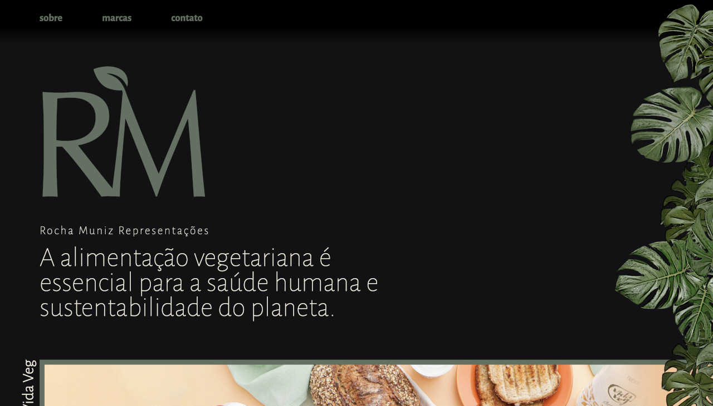

# Rocha Muniz

React application!

https://rochamuniz.com.br/



## 🚀 Starting

These instructions will allow you to make a working copy of the project on your local machine for development and testing purposes.

### 📋 Prerequisites

What things do you need to install the software?

```
node.js ^12
```

### 🔧 Installation

Make a clone of this repository and install it in your development environment using the following command in your terminal (choose an appropriate directory):

```
git clone https://github.com/decarolis/rm-representacoes.git

```

After cloning the repository content, access the created directory and install the dependencies:

```
cd rm-representacoes

npm install
```

After this installation, run the application with the npm start command. The application will be available at http://localhost:3000.

## 🛠️ built with

- [React: 18.2.0]
- [React-dom: 18.2.0]
- [React-scripts: 5.0.1]
- [React-router-dom: 6.4.2]
- [React-router-dom: 6.4.2]
- [Sass: 1.55.0]

## 📄 License

This project is under the MIT License

---

⌨️ with ❤️ by [André De Carolis](https://github.com/decarolis) 😊
